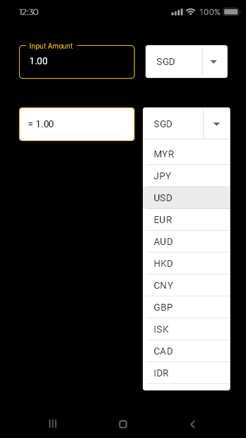
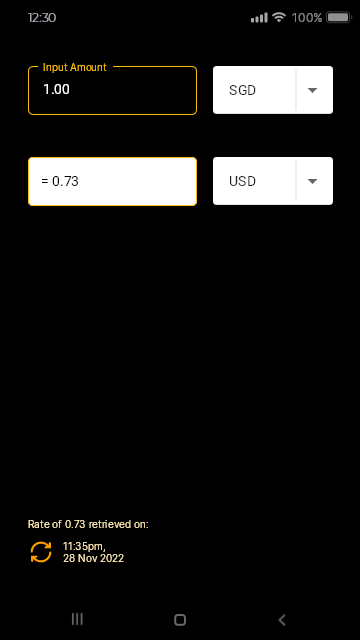

# Mini Currency Converter App
Currency exchange Android app using Jsoup and MVVM architecture. 

This app retrieves your selected currency exchange rates via a Jsoup query search, and calculates the result in a simple and reactive user interface. No backend API subscriptions are needed in this project, so an unlimited number of search queries can be performed with just an internet connection. 

&ensp;

 

&ensp;

## References
- https://www.youtube.com/watch?v=PgkNC7AneKI
- https://www.youtube.com/watch?v=ct5etYgB5pQ
- https://www.youtube.com/watch?v=hHbWF1Bvgf4
